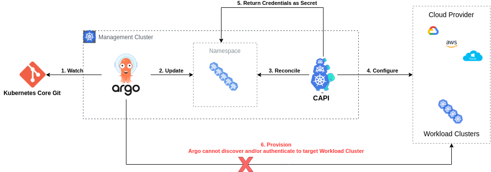
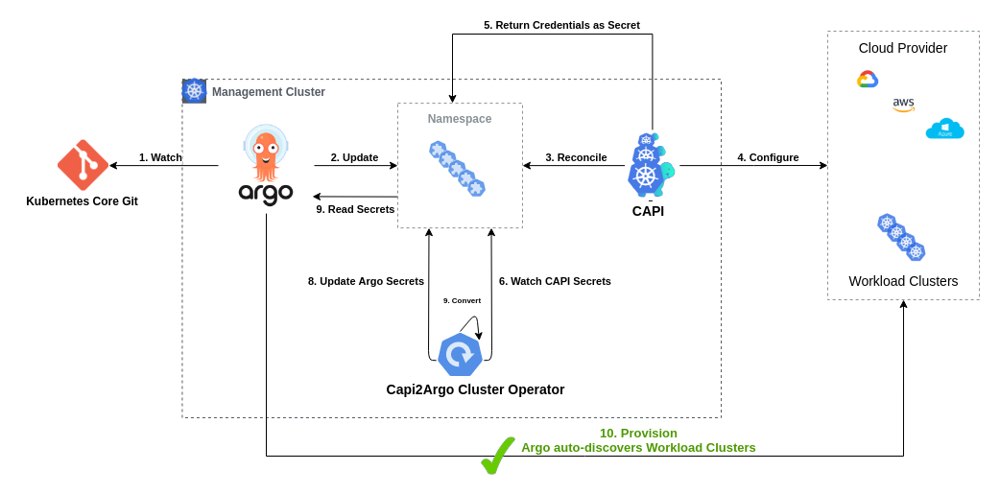

# Capi2Argo Cluster Operator

[](https://github.com/dntosas/capi2argo-cluster-operator/actions/workflows/ci.yml) | [](https://goreportcard.com/badge/github.com/dntosas/capi2argo-cluster-operator) | [](https://github.com/dntosas/capi2argo-cluster-operator/actions/workflows/go-release.yml) | [](https://github.com/dntosas/capi2argo-cluster-operator/actions/workflows/helm-release.yml) | [](https://codecov.io/gh/dntosas/capi2argo-cluster-operator)

Capi-2-Argo Cluster Operator (CACO) converts ClusterAPI Cluster credentials into ArgoCD Cluster definitions and keep them synchronized. It aims to act as an integration bridge and solve an automation gap for users that combine these tools to provision Kubernetes Clusters.

## What It Does

Probably to be here, you are already aware of **ClusterAPI** and **ArgoCD**. If not, lets say few words about these projects and what they want to offer:

- [ClusterAPI](https://cluster-api.sigs.k8s.io/) provides declarative APIs and tooling to simplify provisioning, upgrading, and operating multiple Kubernetes clusters. In simple words, users can define all aspects of their Kubernetes setup as CRDs and CAPI controller -which follows [operator pattern](https://kubernetes.io/docs/concepts/extend-kubernetes/operator/)- is responsible to reconcile on them and keep their desired state.

- [ArgoCD](https://argo-cd.readthedocs.io/en/stable/) is a declarative, GitOps continuous delivery tool for Kubernetes. It automates the deployment of the desired application states in the specified target environments. In simple words, give a Git and a target Kubernetes Cluster and Argo will keep you package up, running and always in-sync with your source.

So, we have CAPI that enables us to define Clusters as native k8s objects and ArgoCD that can take these objects and deploy them. Let's demonstrate how a pipeline like this could look like:



0. Git holds multiple Kubernetes Clusters definitions as CRDs
1. Argo watches these resources from Git
2. Argo deploys definitions on a Management Cluster
3. CAPI reconciles on these definitions
4. CAPI provisions these Clusters on Cloud Provider
5. CAPI returns provisioned Cluster information as k8s Secrets
6. :x: Argo is not aware of remote Clusters plus cannot authenticate to provision additional resources

Ok, all good until here. But having bare naked k8s clusters is not something useful. Probably dozens of utils and addons are needed for a cluster to look handy (eg. CSI Drivers, Ingress Controllers, Monitoring, etc).

Argo can also take care of deploying these utils but eventually credentials will be essential to authenticate against target clusters. Of course, we can proceed with the following three manual steps to solve that:

- Read CAPI credentials
- Translate them to Argo types
- Create new Argo credentials

But how can we automate this? Capi2Argo Cluster Operator was created so it can take care of above actions.

CACO implements them in an automated loop that watches for changing events in secret resources and if conditions are met to be a CAPI compliant, it converts and deploy them as Argo compatible ones. What is actually does under the hood, is a god simple [KRM](https://github.com/kubernetes/design-proposals-archive/blob/8da1442ea29adccea40693357d04727127e045ed/architecture/resource-management.md) transformation like this:

Before we got only [CAPI Cluster Spec]():

```yaml
kind: Secret
apiVersion: v1
type: cluster.x-k8s.io/secret
metadata:
  labels:
    cluster.x-k8s.io/cluster-name: CAPICluster
  name: CAPICluster-kubeconfig
data:
  value: << CAPICluster KUBECONFIG based64-encoded >>
```

After we have also [Argo Cluster Spec](https://argo-cd.readthedocs.io/en/stable/operator-manual/declarative-setup/#clusters):

```yaml
kind: Secret
apiVersion: v1
type: Opaque
metadata:
  labels:
    argocd.argoproj.io/secret-type: cluster
    capi-to-argocd/owned: "true" # Capi2Argo Controller Ownership Label
  name: ArgoCluster
  namespace: argocd
stringData:
  name: CAPICluster
  server: CAPIClusterHost
  config: |
    {
      "tlsClientConfig": {
        "caData": "b64-ca-cert",
        "keyData": "b64-token",
        "certData": "b64-cert",
      }
    }
```

Above functionality use-case can be demonstrated by extending the Workflow mentioned above by automating following steps:

6. CACO watches for CAPI cluster secrets
7. CACO converts them to Argo Clusters
8. CACO creates them as Argo Clusters
9. Argo reads these new Clusters
10. :heavy_check_mark: Argo provisions resources to CAPI Workload Clusters



## Inherit labels from Cluster resources

Capi-2-Argo Cluster Operator is able to take along labels from a `Cluster` resource and place them on the `Secret` resource that is created for the cluster. This is especially useful when using labels to instruct ArgoCD which clusters to sync with certain applications.

To enable this feature, configure a label-prefix on environment `CACO_INHERIT_LABEL_PREFIX` or via Helm values.

The following example takes as configured prefix `label-k8s-io` to inherit labels to rendered resources:

```yaml
apiVersion: cluster.x-k8s.io/v1beta1
kind: Cluster
metadata:
  name: ArgoCluster
  namespace: default
  labels:
    label-k8s-io.foo: "bar"
    label-k8s-io/env: "test"
spec:
// ..
```
Results in the following `Secret` resource:

```yaml
kind: Secret
apiVersion: v1
type: Opaque
metadata:
  name: ArgoCluster
  namespace: argocd
  labels:
    argocd.argoproj.io/secret-type: cluster
    capi-to-argocd/owned: "true"
    label-k8s-io.foo: "bar"
    label-k8s-io/env: "test"
stringData:
// ...
```

## Use Cases

1. Keeping your Production Pipelines DRY, everything as testable Code
2. Avoid manual steps for credentials management through UI, cron scripts and orphaned YAML files
3. Write end-2-end Infrastructure tests by bundling all the logic
4. Enabler for creating trully dynamic environments when using ClusterAPI and ArgoCD

## Installation

**Helm**

```console
$ helm repo add capi2argo https://dntosas.github.io/capi2argo-cluster-operator/
$ helm repo update
$ helm upgrade -i capi2argo capi2argo/capi2argo-cluster-operator
```

Check additional values configuration in [chart readme file](./charts/capi2argo-cluster-operator/README.md).

## Development

Capi2Argo is builded upon the powerful [Operator SDK](link).

Gradually -and depends on how free time allow us- will try adopting all best practices that are suggested on the community, find more in [here](https://sdk.operatorframework.io/docs/best-practices/best-practices/).
- `make all`
- `make ci`
- `make run`
- `make docker-build`

## Contributing

TODO
In the meantime, feel free to grab any of unimplemented bullets on the Roadmap section :).

## Roadmap

### v0.1.0

- [x] Core Functionality: Convert CAPI to Argo Clusters
- [x] Unit Tests
- [x] Integration Tests
- [x] Helm Chart Deployment
- [x] FAQ and Docs

### v0.2.0

- [ ] Adopt [Operator Best Practices](https://sdk.operatorframework.io/docs/best-practices/best-practices/)
- [x] Garbage Collection
- [ ] Quickstart Deployment (Kind Cluster)
- [ ] Support for filtering Namespaces
- [x] Support for multi-arch Docker images (amd64/arm64)